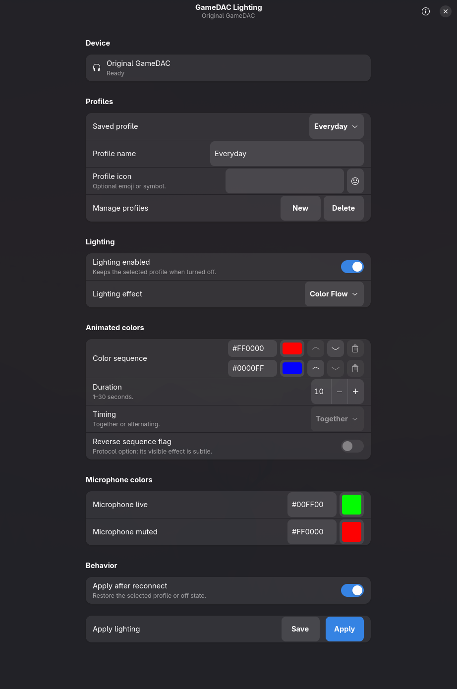

# gamedacctl

An independent Linux lighting controller for the original wired SteelSeries Arctis Pro connected through the original GameDAC, plus the reverse-engineering evidence behind it.

`gamedacctl` is an unofficial community project. It is not affiliated with, endorsed by, or supported by SteelSeries. Product names are used only to describe compatibility.



`gamedacctl` can set independent Solid Left, Right, and microphone-state colors, turn lighting off without replacing the selected profile, generate two-color Color Flow, one-to-four-color Color Pulse, and the connected Across effect, and optionally restore the saved state after reconnect. It controls GameDAC USB device `1038:1280`; audio remains on the separate `1038:1282` interface.

## Install on Arch Linux

Download `gamedacctl-0.1.3-1-x86_64.pkg.tar.zst` from the [v0.1.3 release](https://github.com/AndreasDellrud/gamedacctl/releases/tag/v0.1.3), then install the locally downloaded package:

```bash
sudo pacman -U ./gamedacctl-0.1.3-1-x86_64.pkg.tar.zst
```

Reconnect the GameDAC once so the packaged, interface-scoped udev rule takes effect, then launch **GameDAC Lighting** from the application menu or run `gamedacctl-gui`. Package installation does not change PipeWire or WirePlumber configuration. The release also includes `SHA256SUMS`, a checksum-pinned source archive, `PKGBUILD`, and `SRCINFO` for independent verification or rebuilding.

## Compatibility at a glance

| Hardware or capability | Status |
| --- | --- |
| Original GameDAC `1038:1280` with original wired Arctis Pro | Physically verified |
| GameDAC audio device `1038:1282` | Preserved, not controlled |
| Arch Linux with Omarchy | Physically verified |
| Other Linux distributions with GTK 4, libadwaita, hidraw, and udev | Expected, not yet verified |
| GameDAC Gen 2, Arctis Nova, wireless base stations, and other USB identities | Unsupported and rejected |
| Sonar, EQ, proprietary DTS/Headphone:X, and firmware updates | Out of scope |

Physical support is currently limited to the original GameDAC with the original wired Arctis Pro. GameDAC Gen 2, Arctis Nova products, wireless base stations, other SteelSeries USB identities, and multiple simultaneously connected GameDAC units are not supported. See the [compatibility matrix](docs/compatibility.md) for the tested firmware and precise feature boundaries.

## Omarchy integration

The optional [`omarchy-gamedacctl`](https://github.com/AndreasDellrud/omarchy-gamedacctl) bar plugin shows device status, applies saved profiles, opens the full controller, and shares the profile-preserving master lighting switch. USB access and packet generation remain entirely in `gamedacctl`.

After installing this package, add the plugin with:

```bash
omarchy plugin add https://github.com/AndreasDellrud/omarchy-gamedacctl.git --enable
```

## Build from source

The project pins its Rust toolchain through [mise](https://mise.jdx.dev/):

```bash
mise install
mise exec -- cargo build
```

Launch the native GTK/libadwaita application during development with:

```bash
mise exec -- cargo run --bin gamedacctl-gui
```

The adaptive GTK/libadwaita GUI presents the verified effects with descriptive names: Solid, Color Flow, and Color Pulse. These map to the protocol's Steady, ColorShift, and Multi Color Breathe forms; the connected Sweep behavior appears as Across. Native color dialogs remain synchronized with exact hex values, animated palettes can be reordered, and independent microphone colors remain visible with every effect. A master switch turns every lighting zone off without replacing or modifying the selected profile, and turning it back on restores that profile. The application saves versioned profiles with optional emoji or glyph icons under `$XDG_CONFIG_HOME/gamedacctl/profiles.json` (normally `~/.config/gamedacctl/profiles.json`) and can optionally restore the last lighting state after reconnect. Existing profiles remain compatible. Reconnect restore is disabled by default. The [profile-storage guide](docs/profile-storage.md) documents permissions, concurrent and atomic updates, backup, recovery, and uninstall behavior. Distribution packages install the desktop launcher and original full-color and symbolic application icons with `gamedacctl-gui`.

The [GitHub Actions release pipeline](docs/release-process.md) validates every change and creates the checksum-pinned source, recipe, metadata, and package bundle for matching version tags. The recipe template and local build notes live under [`packaging/arch`](packaging/arch/README.md).

The CLI also exposes a versioned, machine-readable surface for thin desktop
integrations:

```bash
gamedacctl status --json
gamedacctl profile apply Everyday --json
```

`status` opens the known HID interface without writing and reports `ready`,
`disconnected`, `permission-denied`, or `error` together with saved-profile
summaries and their optional icons. Applying a profile records it as selected only after every HID write
succeeds. The optional Omarchy adapter lives in the separate manifest-root
`omarchy-gamedacctl` project and calls only these commands.

Dry runs construct and validate complete reports without opening the device:

```bash
mise exec -- cargo run -- --dry-run static \
  --left FF3700 --right 0084FF \
  --microphone-live 00FF00 --microphone-muted FF0000

mise exec -- cargo run -- --dry-run off

mise exec -- cargo run -- --dry-run breathe \
  --color 7A21E6 --seconds 10 --mode synchronized

mise exec -- cargo run -- --dry-run breathe \
  --color 2468AC --seconds 5 --mode sweep --reverse

mise exec -- cargo run -- --dry-run color-shift \
  --color FF0000 --color 0000FF --seconds 5

mise exec -- cargo run -- --dry-run multi-color-breathe \
  --color FF0000 --color 00FF00 --color 0000FF --seconds 9
```

After device permissions are configured, omit `--dry-run` to apply the selected configuration. `off` defaults to `--target effect`, which covers Left and Right; use `off --target microphone` or `off --target all` explicitly for the microphone zones.

An exact complete animation captured from SteelSeries GG can be replayed for research without synthesizing unknown bytes:

```bash
mise exec -- cargo run -- --dry-run replay \
  --pcap docs/raw/capture-connected-modes-20260905.pcapng \
  --frames 7 11
```

Frames 7 and 11 are the verified 10-second connected Sweep for zones 1 and 0. Frames 31 and 33 are the matching Synchronized configuration. `wireshark-cli` is required for pcap replay.

The original `scripts/gamedac-rgb` Python utility remains the research reference for comparison with early experiments. The packaged narrow udev rule gives the active desktop user access to only `1038:1280` interface `00`; the other GameDAC control interfaces and the `1038:1282` audio device remain outside its scope.

For passive reconnect research, `observe-input` prints device accessibility and unsolicited 64-byte HID input reports for a bounded period. It sends no report to the DAC:

```bash
mise exec -- cargo run --bin gamedacctl -- observe-input --seconds 60
```

Start with [the system overview](docs/overview.md), then use [the documentation index](docs/index.md) for protocol evidence, capture workflow, experiment status, the native application roadmap, and legal/publication considerations.

## Reporting hardware results

Use the [hardware report form](https://github.com/AndreasDellrud/gamedacctl/issues/new?template=hardware-report.yml) for another original GameDAC, a compatibility failure, or a successful test on another Linux distribution. Include the reported USB identity and firmware/device release, but do not attach unfiltered USB captures, device serial numbers, credentials, or proprietary installers.

## Safety

Only packets observed from SteelSeries GG are replayed. Generated commands are limited to verified Steady fields and the observed coefficient-record family on known zones. Durations intentionally accept only whole seconds from 1 through 30. ColorShift is limited to the verified two-color form; Multi Color Breathe accepts the manually observed one-to-four-color range. Longer ColorShift palettes, arbitrary GG marker positions, fractional GG speed mapping, and Reflected generation remain disabled. Do not fuzz unknown commands or accept GameDAC firmware updates inside the Windows VM during capture work.

The application reports successful writes, not firmware readback. Use it at your own risk; unsupported hardware is rejected rather than probed.

## Validation

```bash
scripts/validate
```

This checks documentation, udev and desktop packaging, formatting, linting, packet fixtures, CLI validation, profile persistence, and exact hashes for the physically verified captured presets.

## License

The independently written source code, documentation, and packaging are available under your choice of the [MIT License](LICENSE-MIT) or the [Apache License 2.0](LICENSE-APACHE). SteelSeries product names remain the property of their respective owner and are used only to describe compatibility.
